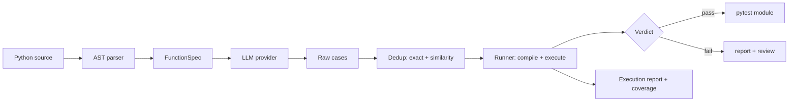

<div align="center">

# llm-testcase-gen

**LLM-powered unit-test generator that actually runs what it generates.**

Parse a Python function → ask an LLM for cases → de-duplicate → **execute every
case against the real function** → report pass/fail and coverage.

[English](#english) · [中文](#中文)

</div>

---

<p align="center">
  
  
  
  
</p>

<a id="english"></a>
## English

Most "LLM test generators" stop at producing plausible-looking JSON. This one
does not: **every generated case is executed against the target function** and
each assertion is evaluated in a sandboxed namespace. The output is not a summary
of what tests *might* look like — it is a verified report of which cases actually
pass.

> Built for 李想 (Lixiang)'s 2027 autumn-recruitment portfolio. The **core** depends
> only on the Python standard library (`ast`, `json`, `hashlib`, …), so it installs
> in seconds and is fully testable offline — no API key required.

### Why this exists (and what it is not)

The recurring failure mode of LLM test generation is **trust without proof**: a
model emits `assert result == 1`, nobody runs it, and it silently encodes a wrong
expectation or a non-executable expression. This tool closes the loop by making
*execution* a first-class stage, not an afterthought. It is **not** a coverage
optimizer (see [Related work](#related-work)) — its job is to turn "the model
thinks these are good tests" into "these tests demonstrably run."

### Pipeline



### Features

- **Zero hard dependencies** for the core. Network providers (`openai`) import
  lazily; an API key is never required for development or CI.
- **AST parser** extracts functions, parameters (annotations & defaults),
  docstrings and return types — no regex hacks.
- **Pluggable providers**: a deterministic offline `MockProvider` (executes the
  target to record ground-truth assertions — ideal for CI/demos) and an
  `OpenAIProvider` for any OpenAI-compatible endpoint.
- **Strategy-driven prompts**: `normal` / `boundary` / `exception` passes.
- **Robust JSON extraction** from LLM replies (tolerates code fences & prose).
- **De-duplication**: exact (canonical key) + similarity (Jaccard, threshold).
- **Execution report**: per-case pass/fail, plus an *executable coverage* score
  (fraction of target functions with ≥1 passing test).
- **Self-contained export**: emit a runnable `pytest` module for any case set.

### Install

```bash
pip install -e .
pip install -e ".[dev]"   # includes the test suite
```

### Quick start (offline, no API key)

```bash
# 1) End-to-end demo (generate + execute + report) on the bundled module:
llm-testcase-gen demo

# 2) Generate cases for your own file:
llm-testcase-gen gen -f examples/sample_math.py --provider mock --dedup -o cases.json

# 3) *Run* them against the real functions and report:
llm-testcase-gen run -f examples/sample_math.py --export results/test_sample_math.py

# 4) Inspect coverage / de-duplicate as before:
llm-testcase-gen report cases.json
llm-testcase-gen dedupe cases.json -o cases.dedup.json
```

### Example: executable verification

`llm-testcase-gen run -f examples/sample_math.py` produces
(`results/execution_report.txt`):

```text
  Functions     : 4
  Cases         : 15
  Passed        : 15
  Failed        : 0
  Exec coverage : 100%
  [divide]   4 passed / 0 failed   (incl. 1 ZeroDivisionError, expected)
  [clamp]    5 passed / 0 failed
  [first]    3 passed / 0 failed
  [normalize] 3 passed / 0 failed
```

A generated case is now a real, runnable test:

```json
{
  "id": "6861417ee565",
  "target": "divide",
  "kind": "normal",
  "description": "Typical call to divide with nominal inputs.",
  "inputs": {"a": 1, "b": 1},
  "expected": "Returns 1.0.",
  "assertions": ["result == 1.0"],
  "provider": "mock"
}
```

`--export` writes these as a self-contained pytest module (exception cases are
wrapped in `pytest.raises`):

```python
def test_divide_6861417ee565():
    """normal: Typical call to divide with nominal inputs."""
    result = divide(a=1, b=1)
    assert result == 1.0
```

See `examples/generated_cases.json`, `results/coverage_report.txt`,
`results/execution_report.txt`, and `results/test_sample_math.py`.

### With a real LLM

```bash
export OPENAI_API_KEY=sk-...
llm-testcase-gen run -f my_module.py --provider openai \
    --model gpt-4o-mini --strategies normal,boundary,exception
```

For Wenxin / Qwen / a local server, set `--base-url`:

```bash
llm-testcase-gen run -f my_module.py --provider openai \
    --base-url https://my-endpoint/v1 --model qwen-max
```

### Related work

This project sits between two mature families; it is deliberately smaller and
focused on the **verification loop** rather than on maximizing coverage.

| Project | Approach | Runs the tests? | LLM-based? | Target |
|---|---|---|---|---|
| **Pynguin** (SAP) | Search-based (DynaMOSA genetic algorithm) | Yes — measures code coverage | No | Python |
| **evoSuite** (U. Sheffield) | Search-based whole-test generation | Yes — branch/line coverage | No | Java |
| **Meta TestGen-LLM** (FSE'24) | LLM improves existing human tests + filtration gates | Yes — filters assure improvement | Yes | Kotlin/Java |
| **CodiumAI / AlphaCodium** | LLM + flow-based test & code generation | Test-based validation | Yes | Multi |
| **llm-testcase-gen (this)** | LLM generates + **executes every case** | Yes — kind-aware, per-case | Yes | Python |

The key differentiator is the **"run, don't trust"** stance: Pynguin/evoSuite
optimize a coverage objective without a model; TestGen-LLM verifies via
*filtration* of LLM output; this tool verifies by **actually executing each
generated case** (and treating `exception` cases as "raise = pass"). It is
offline-first and zero-core-dependency so the whole loop is reviewable without a
key.

### Methodology (engineering judgment)

- **MockProvider executes the target** to record the true return value as the
  expected assertion. This makes the offline fixture self-consistent and lets the
  whole pipeline be developed without a model — it is *not* a stand-in for a real
  LLM, only a deterministic harness.
- **Coverage is dimension-based, not line-based.** We count whether each function
  has ≥1 case in each of `normal`/`boundary`/`exception`, which is what an LLM
  generator can actually influence. For true line/branch coverage of the target,
  run the exported pytest module under `coverage.py`.
- **Kind-aware execution.** `normal`/`boundary` must return and satisfy their
  assertions; `exception` cases are *expected* to raise. This matches how a human
  writes tests and avoids false negatives.
- **Similarity dedup uses token Jaccard on `(target, inputs, assertions)`**,
  explicitly excluding the free-text `description` and the `kind` label, which
  vary most between near-identical cases.

### Limitations & safety

- **Executing generated assertions is a sandbox, not a security boundary.**
  Assertions are evaluated in a namespace with `__builtins__` stripped to a minimal
  allowlist. Do **not** point this at untrusted model output in a shared/multi-tenant
  environment.
- **The MockProvider produces ground-truth cases by execution**; it cannot invent
  meaningful assertions for functions whose behavior it cannot observe. Treat all
  generated cases as *suggested* and review them before merging.
- `pytest.raises`-style assertions are not parsed; for exception cases the runner
  simply expects the call to raise.

### Roadmap

- [ ] Parse `pytest.raises(...)` assertions so exception expectations are explicit.
- [ ] Line/branch coverage of the target via `coverage.py` on exported tests.
- [ ] Pairwise/property strategies (e.g. symmetric, inverse) as prompt passes.
- [ ] Cost & token accounting for the real-LLM path.

### Project layout

```
llm-testcase-gen/
├── README.md
├── pyproject.toml
├── requirements.txt
├── src/llm_testcase_gen/
│   ├── models.py          # FunctionSpec / ParamInfo / TestCase
│   ├── parser.py          # AST-based extraction
│   ├── provider.py        # MockProvider / OpenAIProvider
│   ├── prompt_builder.py  # strategy prompts
│   ├── generator.py       # orchestration + JSON parsing
│   ├── dedupe.py          # exact + similarity de-duplication
│   ├── coverage.py        # coverage report
│   ├── runner.py          # EXECUTE cases + export pytest  ← the core
│   └── cli.py             # command-line entry
├── tests/                 # offline pytest suite (17 tests)
├── examples/              # sample module + generated cases
├── configs/               # default generation config
└── .github/               # CI + issue/PR templates
```

### Tests

```bash
pytest -q
```

---

<a id="中文"></a>
## 中文

多数"LLM 测试用例生成器"止步于产出看起来合理的 JSON。本项目不止于此：**每一条
生成的用例都会被真实执行**，断言逐一求值——输出不是"测试大概长什么样"的描述，而是
"哪些用例真的通过"的验证报告。

> 本项目为李想 2027 秋招作品集的一部分。**核心逻辑零第三方依赖**（仅用 Python 标准
> 库），安装迅速、可完全离线测试。

### 为什么做（以及它不是什么）

LLM 测试生成最常见的失败是**只信任不验证**：模型吐出 `assert result == 1`，没人跑，
它悄悄编码了一个错误预期或一个无法执行的表达式。本工具把"执行"作为一等阶段来闭环——
它**不是**覆盖率优化器（见[相关作品](#相关作品)），它的职责是把"模型觉得这是好测试"
变成"这些测试确实能跑通"。

### 特性

- **核心零硬依赖**；联网的 `openai` 提供者按需懒加载，开发/CI 无需 API Key。
- **AST 解析**：提取函数、参数（含注解与默认值）、文档字符串与返回类型。
- **可插拔提供者**：确定性离线 `MockProvider`（执行目标记录真实断言，适合 CI/演示），
  以及兼容 OpenAI 接口的 `OpenAIProvider`。
- **策略化提示**：`normal` / `boundary` / `exception` 三遍生成。
- **鲁棒 JSON 解析**：兼容代码围栏与冗余文本。
- **去重**：精确（规范化指纹）+ 相似度（Jaccard，可设阈值）。
- **执行报告**：逐用例 pass/fail，以及"可执行覆盖率"（至少一条用例通过的函数占比）。
- **自包含导出**：导出可直接 `pytest` 运行的测试模块。

### 快速开始（离线，无需 API Key）

```bash
llm-testcase-gen demo
llm-testcase-gen gen -f examples/sample_math.py --provider mock --dedup -o cases.json
llm-testcase-gen run -f examples/sample_math.py --export results/test_sample_math.py
llm-testcase-gen report cases.json
```

`run` 是核心命令：生成用例 → 在真实函数上执行 → 逐用例判定 →（可选）导出 pytest 模块。

### 示例：真实执行验证

`llm-testcase-gen run -f examples/sample_math.py` 输出（`results/execution_report.txt`）：

```text
  Functions     : 4
  Cases         : 15
  Passed        : 15
  Failed        : 0
  Exec coverage : 100%
```

生成的用例本身就是可运行的真实测试，完整结果见 `examples/generated_cases.json`、
`results/coverage_report.txt`、`results/execution_report.txt`、`results/test_sample_math.py`。

### 使用真实大模型

```bash
export OPENAI_API_KEY=sk-...
llm-testcase-gen run -f my_module.py --provider openai --model gpt-4o-mini
# 兼容端点（文心 / 通义 / 本地服务）用 --base-url 指定
```

### 相关作品

本项目位于两个成熟家族之间，刻意做得更小、更聚焦"验证闭环"而非最大化覆盖率。

| 项目 | 方法 | 会运行测试吗 | 基于 LLM | 目标语言 |
|---|---|---|---|---|
| **Pynguin**（SAP） | 搜索式（DynaMOSA 遗传算法） | 是——度量代码覆盖率 | 否 | Python |
| **evoSuite**（谢菲尔德大学） | 搜索式整测试生成 | 是——分支/行覆盖 | 否 | Java |
| **Meta TestGen-LLM**（FSE'24） | LLM 改进现有人写测试 + 过滤闸门 | 是——过滤保证改进 | 是 | Kotlin/Java |
| **CodiumAI / AlphaCodium** | LLM + 流程化测试与代码生成 | 测试驱动验证 | 是 | 多语言 |
| **llm-testcase-gen（本项）** | LLM 生成 + **逐条执行** | 是——按 kind 感知 | 是 | Python |

核心差异点是"**跑，别只信**"：Pynguin/evoSuite 在没有模型的情况下优化覆盖率目标；
TestGen-LLM 通过*过滤 LLM 输出*来验证；本工具通过**真正执行每条生成的用例**来验证
（`exception` 类用例"抛异常即通过"）。它离线优先、核心零依赖，整条链路无需 Key 即可
审阅。

### 方法论（工程判断）

- **MockProvider 通过执行目标函数记录真实返回值**作为期望断言，使离线夹具自洽、可在
  无模型环境下完整开发；它是确定性测试桩，而非真实 LLM 的替代。
- **覆盖率为"维度级"而非"行级"**：统计每个函数在正常/边界/异常三个维度是否至少有一条
  用例——这是 LLM 生成器真正能影响的层面。若需目标函数的真实行/分支覆盖率，请用
  `coverage.py` 运行导出的 pytest 模块。
- **按 kind 区分语义**：`normal`/`boundary` 必须返回且满足断言；`exception` 用例
  *预期*抛异常。这与人类写测试的方式一致，避免误判。
- **相似度去重对 `(target, inputs, assertions)` 做 token-Jaccard**，明确排除最易变的
  自由文本 `description` 与 `kind` 标签。

### 局限与安全

- **执行生成断言仅是沙箱，不是安全边界**：断言在剥离 `__builtins__` 的最小允许列表中
  求值。请勿在共享/多租户环境对不受信任的模型输出使用。
- **MockProvider 通过执行产出真实用例**，无法为它观察不到行为的函数编造有意义断言；
  所有生成用例均视为"建议"，合并前请人工审阅。
- 不解析 `pytest.raises` 风格断言；异常类用例只预期"调用抛异常"。

### 路线图

- [ ] 解析 `pytest.raises(...)` 断言，使异常预期显式化。
- [ ] 通过 `coverage.py` 对导出测试做目标函数行/分支覆盖率统计。
- [ ] 增加成对/属性策略（对称、逆运算）作为提示遍。
- [ ] 真实大模型路径的花费与 token 统计。

### 许可证

MIT © 2026 李想 (Lixiang)

---

<div align="center">

**Star ⭐ if this helps your workflow. Issues and PRs welcome.**

</div>
